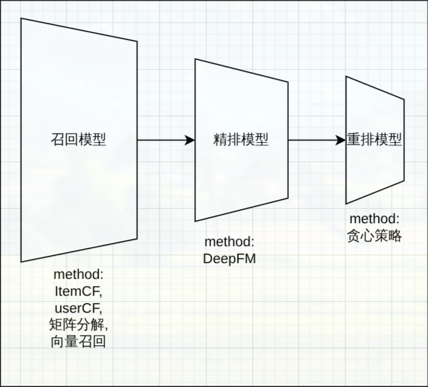

# 推荐系统构建思路

## 架构

采用 **召回 - 精排 - 重排** 三层架构实现:

## 召回模型

> **由于我们目前拥有的数据仅仅只有景点的本身的一些数据(介绍、评论、热度、评分、分类等属性) 以及用户的一些基本特征(年龄、性别、城市、兴趣爱好等), 所以我们初步决定使用向量召回模型 ; 当之后有更多的点击数据的时候可以考虑使用协同过滤, 同时把不同的召回模型进行融合做多路召回(但是需要合理选择每一个召回模型的权重)**

### 向量召回

> **由于我们的系统中完全没有用户交互数据, 所以我们决定构建双塔模型, 支持任何用户特征以及景点特征的输入, 所以此时我们需要的就是有对应的景点特征以及用户特征的数据集**

#### 数据集构建

> **思路: 景点特征就不用多说了**

##### 特征

`Prompt`:

你好, 我的目标是构建一个旅游景点推荐系统, 现在有 1000 条景点数据, 有如下景点:  故宫博物院、八达岭长城、外滩、秦始皇帝陵博物院(兵马俑)、香港迪士尼乐园等 ; 我想要使用双塔模型来构建推荐系统的召回部分, 所以需要用户特征和景点特征; 景点的特征包括景点`id`、景点热度、景点好评数量、景点差评数量、景点介绍、景点所处城市这些基本字段; 现在由于没有 用户特征数据, 我的想法是从用户评论中提取一些用户的特征数据, 现在有若干好评、差评, 格式如下:

好评:

我会再推荐大家去故宫博物院的，因为我因为武英殿的瓷器展时间过于长了，没赶上故宫的下午茶，下次一定把时间计划充裕了，直奔故宫下午茶，然后再去其他场馆。下次我会再去九龙壁，珍宝馆，漱芳斋，西六宫等地。不过我也不会有遗憾，就有遗憾才会有下一次的相遇。最重要的是体验，是感悟，是学到新知。【趣味】印象深刻的就是武英殿的陶瓷馆，五大名窑，陶和瓷的发展历史，制造工艺的不断精进，古代文人雅士的巧思和对外开放的文化碰撞。【景色】故宫处处都是风景，慈宁宫前的梨花开的正盛，映着红墙绿瓦特别美，终于理解了古人极致的中式美学。【性价比】门票不贵，能看到皇族才能欣赏的风景和住所不亏。最后还是要特别提醒，故宫里面无充电宝，请自备2000mA以下的进宫。下午票11点可进，到排队至少2小时，不带包排队的略少，可以看我之前的笔记妙招，小E建议下午13点进宫，排队少，还能有3个半小时，看个人情况选择。

差评:

进去的时候接受了4次行李检查一直同样的风景持续了一个小时左右

目前可以获取到用户特征只有用户城市, 我从评论中提取特征的方法是提出一些分类的特征, 使用 `Embedding` 模型之后计算余弦相似度的方法来关联相关的特征; 

现在请你提出几个不同的分类以及分类中的不同的标签(例如喜欢景点的种类: 自然风光、人文景观、历史景点 ...) 等 用于描述用户特征

**豆包:**

**核心兴趣维度**

景点类型偏好:   人文历史、自然风光、主题娱乐、都市休闲、民俗风情 ...

兴趣细分标签:  文物鉴赏、建筑美学、拍照打卡、亲子互动、文化研学  ...

**消费决策倾向维度**

性价比敏感度: 高性价比偏好、价格不敏感、高价敏感型

体验关注细节: 排队效率敏感、设备完善度敏感、服务质量敏感、行程规划偏好

**出行维度特征:**

出行范围偏好: 同城游玩、跨城旅游、周边短途、长途深度游

出行伙伴偏好: 独自出行、情侣出行、家庭出游、朋友结伴

**情感与体验倾向维度:**

情感极性: 正向体验、负向体验、中立体验

体验需求强度: 深度体验型、打卡打卡型、遗憾留痕型

**`GPT5.1`:**

喜欢的景点类型偏好: 自然风光、人文景观、历史文化类、体闲娱乐、特色体验

出游动机/关注的点偏好: 观光打卡、历史文化学习、亲子/家庭、娱乐放松、社交/情侣、运动/户外

旅游风格偏好: 深度游玩、打卡/快节奏、计划型、随机/佛系

体验维度偏好: 景色/环境、文化/趣味、服务体验、设备便利性、人流/排队情况、交通便利度、性价比敏感、运营管理

用户情绪倾向/评分风格: 情绪倾向、宽容度、负面敏感点

人群属性偏好: 亲子向、老人友好、情侣/夫妻、团队/朋友

时间/季节偏好: 出游时间段、季节偏好

容忍度: 人多容忍度、路程/体力容忍度、安检/规则容忍度

内容形式偏好: 解说/讲解、自由探索

城市/区域派偏好: 常提及去过的城市、海内外偏好

**最终确定的维度:**

**用户特征**

**城市**

**景点兴趣维度(携程中分类)**

**兴趣细分标签**

**性价比敏感度**

**体验关注细节**

**出行范围偏好**

**出行伙伴偏好**

**体验需求强度**

**容忍度**

**时间/季节偏好**

**内容形式偏好**

**景点特征**

**景点 `id`**

**景点 `poiId`**

**景点票价**

**景点评分**

**景点热度**

**景点介绍**

